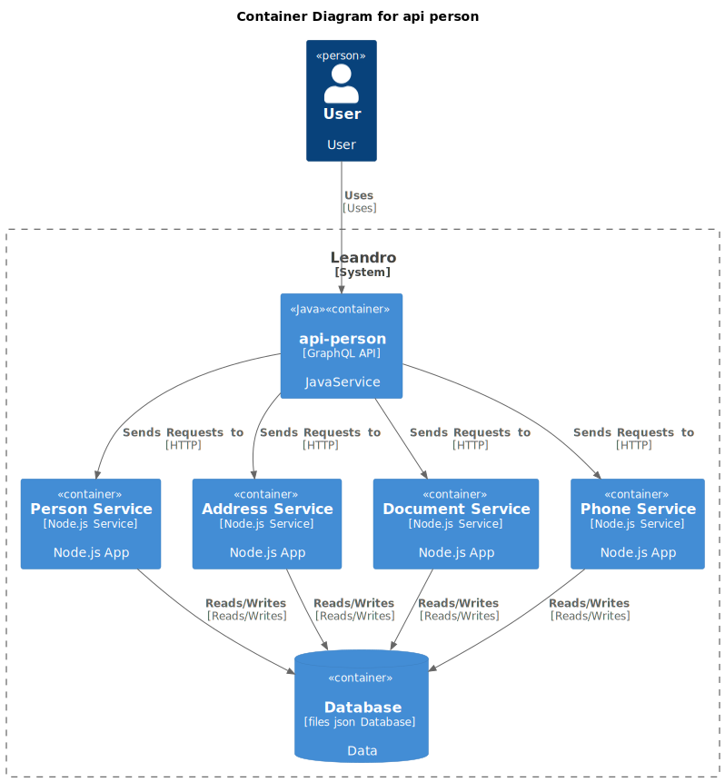

# Projeto API Person
[](https://github.com/leandro0404/api-person/actions/workflows/build.yml)
 

repository-branches-badge.svg

#### Context Diagram - Api person



---
### Local setup
#### Install tools
- Java 17
- Maven 3
- [SDKMAN!](https://sdkman.io/install)
#### Build
```shell
mvn clean install -DskipTests
```
#### Test
```shell
mvn test -Dspring.profiles.active=test
```
#### Run
```shell
mvn spring-boot:run -Dspring-boot.run.profiles=staging -Dserver.port=8080
```


Este projeto é um exemplo de aplicação Java baseada em módulos usando o Spring Framework.
## Módulos
O projeto está organizado em diferentes módulos para separar as responsabilidades:
### application
A camada "application" é responsável por conter a lógica de alto nível da aplicação. Ela engloba a interação com a interface do usuário, processamento de entrada e saída, autenticação, autorização e orquestração de componentes. É o ponto de entrada para os usuários interagirem com a aplicação.
### borders
A camada "borders" define as interfaces e contratos expostos pelo sistema para o mundo externo. Isso inclui interfaces de API, serviços, contratos de mensagens e outros pontos de entrada e saída. Ela atua como uma fronteira que separa as preocupações internas das externas.
### repository
A camada "repository" lida com o acesso aos dados. É onde ocorre a interação com o banco de dados ou outras fontes de dados. Os repositórios fornecem operações para criar, ler, atualizar e excluir dados, isolando o resto do sistema das complexidades da persistência.
### core
A camada "core" contém a lógica de negócios central da aplicação. É onde são implementadas as regras de negócios, a lógica de processamento e as operações principais. Essa camada é a mais interna e não deve depender diretamente de detalhes de implementação externos.
### usecases
A camada "usecases" encapsula casos de uso específicos da aplicação. Ela representa as ações que podem ser executadas dentro da aplicação, encapsulando a lógica de negócios e interações entre os diferentes componentes.
## Instalação e Execução
1. Clone este repositório.
2. Navegue até o diretório `application` e execute a aplicação usando `./mvnw spring-boot:run`.
3. Acesse `http://localhost:8080` em seu navegador para interagir com a aplicação.


## Voyager

